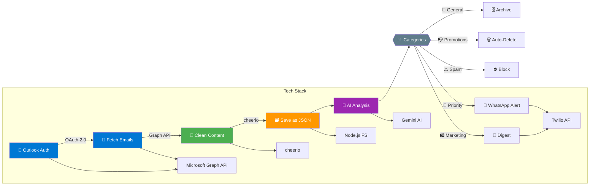

## 🔁  Workflow Diagram

## 🔄 Email Processing Pipeline

1.🔐 Authentication
→ OAuth 2.0 flow with Microsoft Identity Platform
→ Generates access/refresh tokens

2.📩 Email Fetching
→ Graph API GET /me/messages endpoint
→ Filters by current date

3.🧹 Content Cleaning
→ Uses Cheerio to extract clean text
→ Handles HTML/plaintext alternatives

4.🗃️ JSON Storage
    → Saves structured data for AI processing

5.🤖 AI Categorization
→ Gemini Pro for multi-label classification
→ Dynamic prompt engineering

6.📱 WhatsApp Notification
→ Existing Twilio integration

### 🧩 Tech Stack Summary

| Component                 | Purpose                                      | Library Used                    |
|--------------------------|----------------------------------------------|----------------------------------|
| **Authentication**       | Secure Outlook account access                | `Microsoft Identity Platform`    |
| **Email Fetching**       | Retrieve emails with metadata                | `Microsoft Graph api via axios`  |
| **HTML Processing**      | Extract clean text from email bodies         | `cheerio`                        |
| **AI Analysis**   | Categorize emails and detect urgency                | `@google/generative-ai`          |
| **Notification Engine**       | Send WhatsApp alerts                    | `twilio SDK`                     |

---

