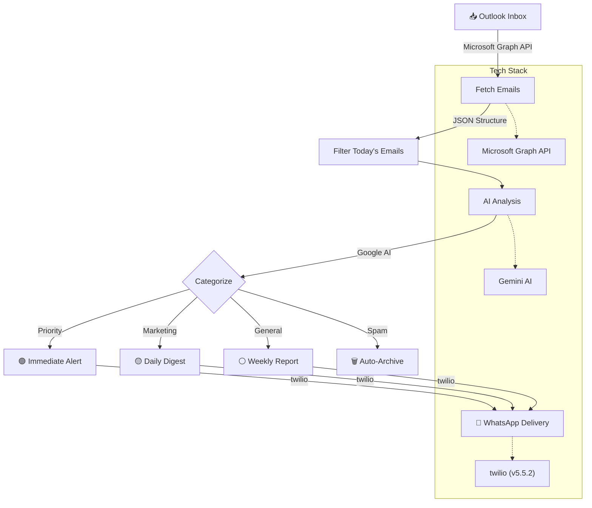

## 🔁  Workflow Diagram

## 🔄 Email Processing Pipeline

1. [GRAPH API] 📥 Outlook Inbox
→ axios with OAuth 2.0
↓

2. [FILTER] ⏳ Today's Emails
→ JavaScript date filtering
↓

3. [ANALYZE] 🧠 AI Categorization
→ @google/generative-ai
↓

4. ROUTE] 🗂️ Priority Decision
├─ 🟢 PRIORITY → Immediate WhatsApp
├─ 🟡 MARKETING → Daily Digest
├─ ⚪ GENERAL → Weekly Report
└─ 🗑️ SPAM → Auto-archive
↓

5 .[DELIVER] 📱 WhatsApp Notification
→ Existing Twilio integration

### 🧩 Tech Stack Summary

| Component                 | Purpose                                      | Library Used                    |
|--------------------------|----------------------------------------------|----------------------------------|
| **Email Fetching**       | Read email inbox                             | `Microsoft Graph api via axios`  |
| **AI Categorization**    | Analyze and label emails                     | `@google/generative-ai`          |
| **Formatting Messages**  | Create WhatsApp-friendly content             | Custom template logic            |
| **WhatsApp Messaging**   | Send messages to users                       | `twilio`                         |

---

